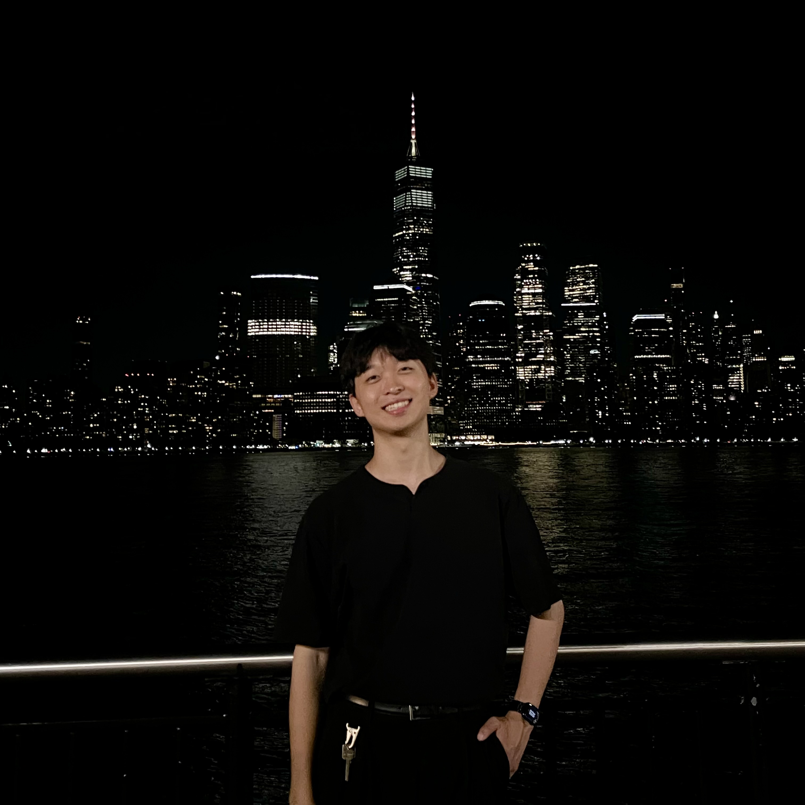

## Markdown

Stony Brook University. 700 Health Sciences Drive. SeungminChou@stonybrook.edu.

700 Health Sciences Dr Stonybrook, New York 11790
Hi there, this is Seungmin. I am a doctorate student at Stony Brook majoring in Data Science. Before Stony Brook, I received my bachelor’s degree at Chung-Ang University, where I was supervised by professor [Changwon Lim](https://sites.google.com/view/cwlim/members/professor).

I’m posting some interesting parts of statistics, mathematics and data science, so feel free to stay here! For now, what interests me is how to build a Bayesian model that is transparent, reliable and yet practical. Any idea is welcome!
